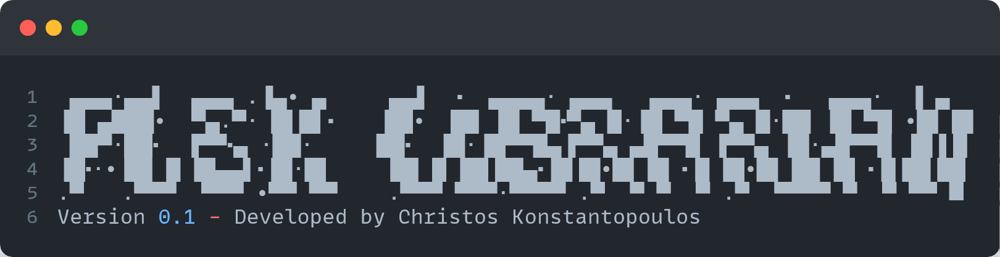

<span>


</span>

## Table of Contents
- [Installation](#installation)
- [Usage](#usage)
- [Contributing](#contributing)
- [License](#license)

## Installation
Provide step-by-step instructions on how to install the project. Include any prerequisites or dependencies required.
```bash
$ git clone https://github.com/username/project.git
$ cd project
$ npm install  # or any other installation command
```
## Installation
```bash
$ command-to-run Project --option
```
## Contributing
Provide guidelines for contributing to the project. Include information about how others can submit bug reports, feature requests, or code contributions.
1. Fork the project.
2. Create your feature branch (git checkout -b feature/AmazingFeature).
3. Commit your changes (git commit -m 'Add some AmazingFeature').
4. Push to the branch (git push origin feature/AmazingFeature).
5. Open a pull request.
## License
Distributed under the MIT License. See `LICENSE` for more information.
